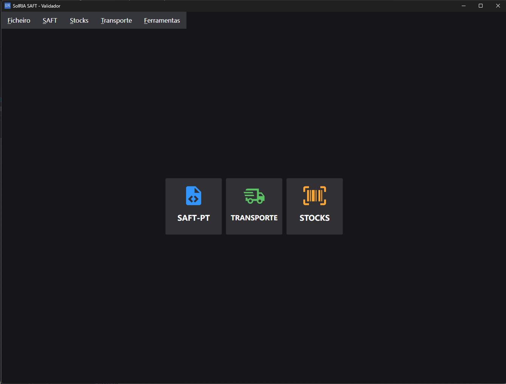

# SolRIA SAF-T (PT) - Validador e Analisador

[](https://github.com/SolRIA/saft-pt)
[](https://dotnet.microsoft.com/)
[](https://avaloniaui.net/)
[](https://www.portaldasfinancas.gov.pt)

Aplicação multiplataforma moderna para **validação de estrutura, regras de negócio e assinaturas digitais** de ficheiros fiscais da Autoridade Tributária e Aduaneira (AT) em Portugal.

---



---

## 🚀 Visão Geral

O **SolRIA SAF-T (PT)** foi concebido para empresas, gabinetes de contabilidade, auditores e programadores de software de faturação que necessitam de inspecionar, auditar e validar ficheiros fiscais antes da sua submissão oficial à AT.

A ferramenta combina uma interface gráfica intuitiva com um motor de validação de alto desempenho capaz de processar ficheiros de grande dimensão com baixo consumo de recursos.

---

## ✨ Funcionalidades Principais

### 📄 1. Validador e Analisador SAF-T (PT)
- **Faturação e Contabilidade**: Suporte completo a ficheiros de Faturação (*Billing*) e de Contabilidade (*Accounting*).
- **Conformidade Legal**: Compatível com as portarias em vigor, incluindo a **Portaria 302/2016** (versão de esquema **1.04_01**) e portarias anteriores.
- **Validação de Estrutura (XSD)**: Deteção de inconformidades sintáticas e de schema XML.
- **Regras de Negócio AT**: Verificação de totais de controlo, coerência entre linhas e cabeçalhos, datas, numeração sequencial e taxas de imposto.
- **Validação Criptográfica de Assinaturas Digitais**: Verificação encadeada do hash RSA SHA-1 das faturas emitidas.
- **Dois Motores de Processamento**:
  - ⚡ **Novo Validador (Streaming / SQLite)**: Desenvolvido para ficheiros de elevada dimensão (dezenas ou centenas de megabytes), processando os dados através de fluxo contínuo e armazenamento em base de dados local SQLite sem esgotar a memória RAM da máquina.
  - 💾 **Validador em Memória**: Carregamento integral e imediato para ficheiros de dimensão padrão.
- **Inspeção Detalhada por Módulos**:
  - **Cabeçalho (*Header*)**: Dados da empresa, software emissor, números de certificação e período de tributação.
  - **Clientes (*Customers*)** e **Fornecedores (*Suppliers*)**.
  - **Produtos e Serviços (*Products*)**: Referências, códigos aduaneiros e tipos de artigo.
  - **Impostos e IVA (*Taxes*)**: Taxas aplicadas e validação dos códigos de motivo de isenção de IVA.
  - **Documentos de Faturação (*Invoices*)**: Listagem, pesquisa, filtros e detalhe individual de cada linha e imposto.
  - **Documentos de Conferência (*Working Documents*)**: Faturas pró-forma, orçamentos e consultas de mesa.
  - **Documentos de Movimentação (*Movement of Goods*)**: Guias de transporte e de remessa.
  - **Pagamentos e Recibos (*Payments*)**: Meios de pagamento e recibos emitidos.
  - **Movimentos Contabilísticos (*General Ledger Entries*)**: Diários, lançamentos a débito e a crédito.
- **Diagnóstico e Relatório de Erros**:
  - Listagem com identificação de tipo, gravidade, campo afetado e mensagem explicativa.
  - Resumo analítico com totais de controlo para conferência imediata.

---

### 📦 2. Existências (Stocks) - Inventário Anual
- Comunicação anual de inventários à Autoridade Tributária.
- Suporte para ficheiros nos formatos oficiais **XML** e **CSV**.
- Validação do cabeçalho do inventário e NIF comunicante.
- Listagem e conferência dos produtos inventariados e respetivas quantidades/valores.

---

### 📥 3. Documentos AT (e-Fatura JSON)
- Importação e conferência de ficheiros **JSON** exportados a partir do portal da AT.
- Análise de faturas eletrónicas comunicadas para auditoria cruzada com os sistemas de faturação.

---

### 🚚 4. Guias de Transporte
- Conferência e validação de documentos de movimentação de bens e circulação de mercadorias.
- Validação da coerência de transporte antes do envio do ficheiro ou da emissão.

---

### 🛠️ 5. Ferramentas Rápidas e Utilitários
- 🔑 **Converter Chave .PEM**: Utilitário para conversão de chaves privadas em formato `.pem` para parâmetros RSA .NET (XML) para testes e assinatura de software.
- 🛡️ **Testar Hash de Faturação**: Validação e teste interativo da geração de assinaturas digitais a partir de chaves públicas/privadas.

---

### 🎨 6. Interface Moderna & Experiência de Utilização
- **Multiplataforma Nativo**: Suporte consistente em **Windows**, **macOS** e **Linux** através do Avalonia UI.
- **Temas**: Alternância dinâmica entre tema **Claro (*Light*)**, **Escuro (*Dark*)** ou automático (**Sistema**).
- **Dashboard com Ficheiros Recentes**: Acesso imediato aos últimos ficheiros abertos com histórico persistente.
- **Ligações Oficiais AT**: Atalhos diretos para o Portal das Finanças e para a plataforma de envio do SAF-T (*e-Fatura*).

---

## 💻 Ferramenta de Linha de Comandos (CLI)

O repositório inclui igualmente uma aplicação de consola (`ConsoleApp`) baseada em **Spectre.Console**, permitindo a integração de validações em pipelines de automação, CI/CD ou processamentos em lote (*batch*).

---

## 🏗️ Estrutura da Solução

- `src/Solria.SAFT.Desktop/Solria.SAFT.Desktop`: Aplicação Desktop com interface gráfica em Avalonia UI (arquitetura MVVM).
- `src/Solria.SAFT.Desktop/Solria.SAFT.Parser`: Biblioteca de análise (parsing), escrita, regras de negócio e validação SQLite/XML.
- `src/Solria.SAFT.Desktop/ConsoleApp`: Aplicação CLI de validação.

---

## ⚙️ Como Compilar e Executar

### Pré-requisitos
- [.NET SDK](https://dotnet.microsoft.com/download) instalado (versão 6.0 ou superior).

### Compilar a Solução
```bash
dotnet build src/Solria.SAFT.Desktop/Solria.SAFT.Desktop.sln
```

### Executar a Aplicação Desktop
```bash
dotnet run --project src/Solria.SAFT.Desktop/Solria.SAFT.Desktop/Solria.SAFT.Desktop.csproj
```

---

## 📜 Legislação e Referências

- [Portaria n.º 302/2016](https://dre.pt/dre/detalhe/portaria/302-2016-105436329) - Estrutura do ficheiro SAF-T (PT).
- [Portal das Finanças - SAF-T (PT)](https://faturas.portaldasfinancas.gov.pt/) - Especificações técnicas e manuais oficiais de apoio.

---

## 📄 Licença

Este projeto é disponibilizado em código aberto sob a licença [MIT](LICENSE).

